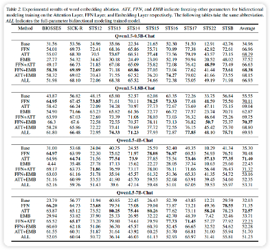

# What Limits Bidirectional Model's Generative Capabilities? A Uni-Bi-Directional Mixture-of-Expert Method For Bidirectional Fine-tuning

We demonstrate that bidirectional training leads to an increase in subsequent dependency, and propose  A Uni-Bi-Directional Mixture-of-Expert Large Language Model.

[paper link](https://icml.cc/virtual/2025/poster/44255)


# 1.Get Started
## 1.1 🛠️ Preparation
```
pip3 install torch torchvision torchaudio

git clone https://huggingface.co/Qwen/Qwen2.5-0.5B-Instruct
git clone https://huggingface.co/Qwen/Qwen2.5-1.5B-Instruct
git clone https://huggingface.co/Qwen/Qwen2.5-3B-Instruct
git clone https://huggingface.co/Qwen/Qwen2.5-7B-Instruct
git clone https://huggingface.co/Qwen/Qwen2.5-14B-Instruct
```
## 1.2 Run 

### Calculate DP
```
python caculate_dp.py
```

### Train Embedding Model
```
python train_bi.py
```

### Train UBMOE
```
python train_ubmoe.py
```

#  2.Experimental result

## 2.1 Embedding

The experimental results of the embedding task are shown in the following table. At all model scales, although the fine-tuning strategies of different layers have slight differences in effect, fine-tuning only the FFN layer or the attention layer demonstrates robust performance in the task of text similarity calculation.



## 2.2 DP

We further analyzed the backward dependency distribution of the model trained based on bidirectional contrastive learning on these two modules (FFN and Attention), as well as its evaluation on different tokens. The results are shown in the following table. The results show that fine-tuning only the FFN layer always exhibits the lowest backward dependence at all model scales. This indicates that fine-tuning the FFN layer has the least impact on the overall dependence of the model.


## 2.3 UBMOE

The generation performance of UBMoE-LLM is shown in the following table. On the TruthfulQA dataset, our method consistently demonstrates performance improvement while maintaining a strong generation capability. Meanwhile, since only the token allocation ability was learned during the training stage, performance degradation in some generation tasks is inevitable. This is because the bidirectional experts only encountered the word embedding task during the training process and did not go through the instruction alignment process. Therefore, their generation ability is weakened.


# Citing 
```

```